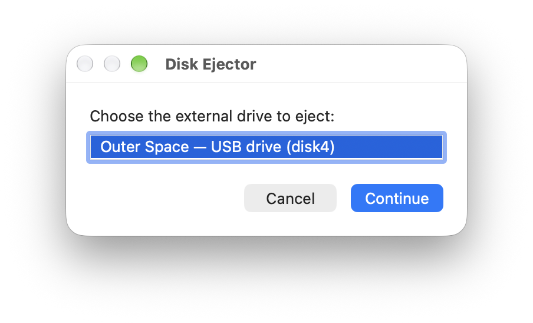

# Disk Ejector for macOS

 

Safely eject an external drive when your Mac says “The disk wasn't ejected because one or more programs may be using it” — without using Force Eject.

## 1. What This Is

Users who store their main Photos Library (with iCloud sync on) on an external drive may find that the drive remains busy and cannot be ejected normally, even after they have closed the relevant windows and applications. This can happen because macOS search, photo-analysis, and iCloud Photos services may continue using the library in the background.

Disk Ejector provides a one-click way to deal with this. When you click **Eject** in the app, it first asks macOS to eject the drive normally. If that fails, it asks several relevant background services to stop temporarily, waits briefly, and then tries the normal eject method again. It never uses Force Eject.

## 2. Installation

Disk Ejector requires macOS Sequoia 15.7 or later.

1. Download [Disk-Ejector.zip](https://github.com/Longcheng-Xiang/macos-disk-ejector/releases/latest/download/Disk-Ejector.zip).
2. If your browser hasn't already done so, open the downloaded ZIP file. Then drag **Disk Ejector.app** into your **Applications** folder.
3. Open Disk Ejector. Because it isn't notarized (checked by Apple for a yearly fee), macOS will say it could not verify the app. Click **Done**.
4. Open **System Settings → Privacy & Security**, scroll down, and click **Open Anyway** next to the message about Disk Ejector. Click **Open Anyway** again when asked, and confirm with your password or Touch ID. You only need to do this once.

## 3. Using The App

1. Make sure that you fully close all apps and windows related to the external drive, just as you normally would before safely ejecting it.
2. Open Disk Ejector and select your drive.
3. Click **Eject**. The app will first try the standard macOS eject method—the same method used by the Eject button next to a drive in Finder. If that does not succeed, the app will ask the relevant background services to stop and try the standard eject method up to five more times. If every attempt fails, the app will report that the drive could not be safely ejected. This normally means that another window or application is still using the drive.

## 4. Risk And Motivation

There is some risk involved with using this app. Its behavior sits between the standard macOS eject method, which is the safest option, and Force Eject, which may cause lost or damaged files.

Disk Ejector never force-unmounts or force-ejects a drive. However, asking background services to stop may interrupt ongoing photo analysis or syncing, or briefly interrupt Siri. Before using the app, close applications related to the drive and avoid using it during an active photo import, export, or synchronization.

When you have your main Photos Library on an external drive, you will often find that it is impossible to eject that drive normally. Disk Ejector was created as a convenient way to stop those services temporarily and retry the normal macOS eject method.

## 5. For More Technically Inclined Persons

The following explains how exactly the app works for more technically inclined persons.

Disk Ejector first asks macOS to perform a normal eject. If that fails, the app sends a normal `TERM` signal to the following per-user search, photo and Siri services before retrying up to five times:

- `Spotlight`
- `photoanalysisd`
- `photolibraryd`
- `mediaanalysisd`
- `managedcorespotlightd`
- `cloudphotod`
- `PhotosReliveWidget`
- `Siri AI`

On macOS 27, the Photos widget (`PhotosReliveWidget`) and `Siri AI` can also keep the Photos Library open.

`TERM` is a request for a process to exit cleanly; it is not a force-kill signal. macOS can start these services again when they are needed. Disk Ejector does not disable them permanently, force-quit ordinary applications, or force-unmount the drive. Applications such as Finder, Terminal, Photos, or Blender can still prevent ejection when they have files open on the selected drive.

- `disk_ejection.applescript` provides the user interface and progress state.
- `disk_ejection.sh` discovers drives and performs the eject attempts.
- `build_disk_ejection.sh` builds and signs the app.

This project is available under the MIT License. See [LICENSE](LICENSE).

---

If Disk Ejector saved you from Force Eject, a ⭐ will help me a long way.
